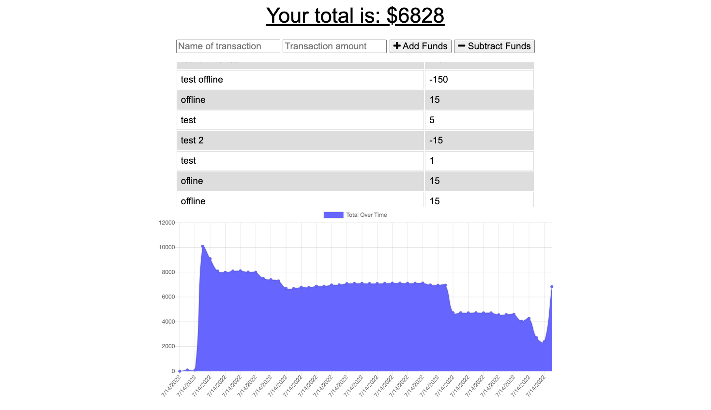

# Offline Budget Tracker
  ## Table of Contents:
  1. [Description](#description) 
  2. [Instructions](#instructions)
  3. [Use](#use)  
  4. [Contribute](#contribute)
  5. [Tests](#tests)
  6. [License](#license)
  7. [GitHub](#github)
  8. [E-mail](#e-mail)
  9. [Links](#links)
## Description
This project was completed as a part of U of M coding bootcamp. The front end code and some of the back-end was provided. 
## Instructions
This application does not need to be installed to use. Go to the published website and it can be used. To edit the app clone the repo and compelte and npm install to install dependencies.
## Use
This can be used as a learning tool or to track your own expenses. 
## Contribute
This project is not open to contrabutions at this time.
## Tests
There are no tests written as a part of this assignment.
## License

## GitHub
rehpotsirhc21
## E-mail
langnerc@icloud.com

## Links
Heroku: https://invulnerable-chaise-47068.herokuapp.com/

GitHub: https://github.com/rehpotsirhc21/Offline-budget/tree/main

